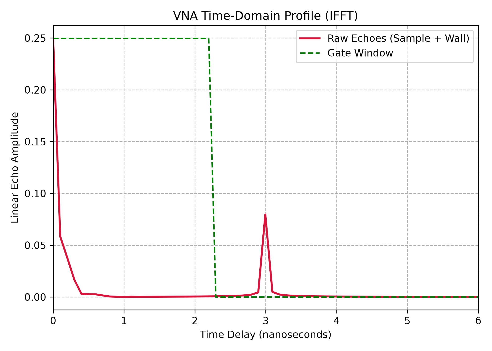
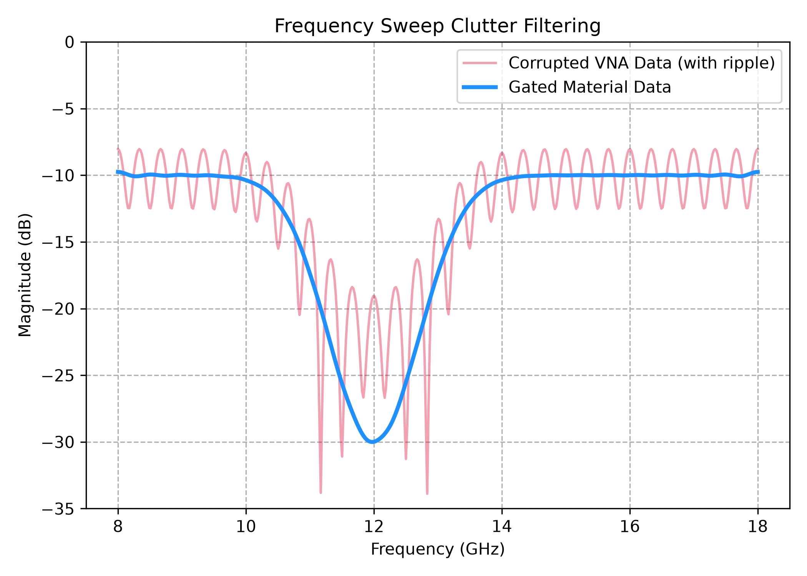

# Vector Network Analyzer (VNA) Error Calibration and Time-Domain Gating Pipelines

## Objective & Purpose
This is a brief Python script to simulate a corrupted X/Ku-band frequency sweep to demonstrate how an Inverse Fast Fourier Transform (IFFT) can translate frequency data into a time-of-flight timeline which allows us to drop a mathematical gate around the material sample and clear out stray background reflections.

Unwanted reflections from stationary background items such as walls, lab benches, etc., collide and constructively and destructively interfere with the desired reflections from a material sample. Those unwanted reflections also create a cyclical wave pattern—known as an **amplitude ripple** which distorts the true resonance nulls of your Device Under Test (DUT).

Standard coaxial calibration protocols (like SOLT) use physical threaded adapters to tell the VNA to ignore internal instrument cables, but this kind of calibration kit cannot be used in open-air material testing. Instead, TRL (Thru-Reflect-Line) calibration is done to zero out the antenna paths and **time-domain gating** is applied to physically cut the background out of our data.

Converting the frequency data into a time-of-flight timeline maps reflections to physical distances along a test bench. This allows the material sample to be isolated from the delayed background reflections arriving **3.0 nanoseconds** late.

## Signal Processing Pipeline
1. **Frequency Data Collection:** Models an incoming wideband scattering parameter (S₁₁) array across an 8 to 18 GHz frequency sweep over 512 discrete test points.
2. **Time-Domain Shift (The IFFT Step):** Runs an Inverse Fast Fourier Transform on the complex datasets to build a time-of-flight coordinate timeline mapping directly to physical distance along the lab bench.
3. **Mathematical Gating:** Applies a rectangular gate window set to unity (1.0) across the primary sample zone and forces everything past a **2.2 ns threshold** down to absolute zero (0.0).
4. **Spectral Restoration (The FFT Step):** Converts the gated time-domain spike back to frequency coordinates via a forward FFT, producing a ripple-free parabolic curve tracking true material traits.

## Repository Architecture
- `src/time_domain_gating.py` - Core Python script that produces synthetic data, multipath reflections, does Hanning windowing and time gating, and creates plots. 

## Calibration Verification Data
Results show convergence when correcting corrupted wideband data:


- **Time-Domain Profile:** Pins the main radar target interface exactly at 0 ns and flags the secondary multi-path wall reflection spike arriving at 3 ns.

- **Frequency Profile:** The uncalibrated raw vector displays heavy sinusoidal oscillations across the entire band. Applying the time gate filters that out entirely, resulting in a smooth, parabolic resonance drop down to **-30 dB** right at the 12 GHz center mark.

## Execution & Requirements
The framework relies on native numpy matrix calculations to preserve timing grids.

```bash
pip install -r requirements.txt
python src/time_domain_gating.py
```
